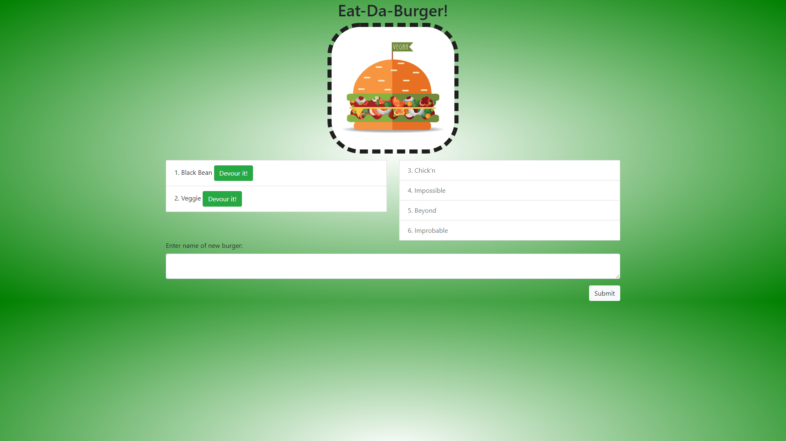

# Burger


This project is a simple demonstration of a full stack application (MySQL with an ORM, Express, Handlebars,and Node.js) that tracks burgers entered by the user and their devoured status. Users can enter a burger into the system, view the list of undevoured burgers, devour any burger they choose, and view the list of devoured burgers.

## Table of Contents
- [Burger](#burger)
  - [Table of Contents](#table-of-contents)
  - [Installation](#installation)
    - [Front End](#front-end)
    - [Back End](#back-end)
  - [Launch](#launch)
  - [Usage](#usage)
  - [Testing](#testing)
  - [Author](#author)

## Installation

### Front End
After cloning the repository, type:
```
npm install
```
to install all dependencies

### Back End
On a MySQL Server, create the schema and tables using the MySQL script [schema.sql](./db/schema.sql)

## Launch

To start the express server, type:
```
npm start
```
or
```
node ./index.js
```

## Usage

After running the application and visiting the url, view the left pane where undevoured burgers live. To devour a burger, click the Devour it! button. View the list of devoured burgers in the right pane. To enter a new burger, type the name into the form at the bottom and click Submit.

## Testing 
For a set of test objects to start with, run [seeds.sql](./db/seeds.sql)

## Author

* **Johnny Li** - *Initial work* - [reptile18](https://github.com/reptile18)
